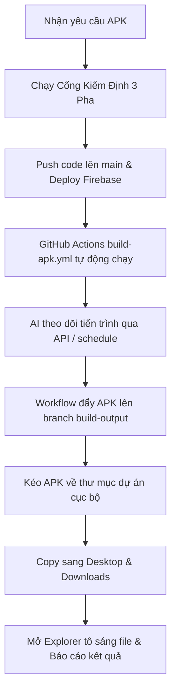

# BỘ LUẬT 06: QUY TRÌNH ĐÓNG GÓI & BIÊN DỊCH ỨNG DỤNG ANDROID (MOBILE APK PIPELINE)

- **Vị trí tài liệu:** `docs/constitution/06-mobile-build-pipeline.md`
- **Các file và thư mục bị điều chỉnh trực tiếp:**
  - `capacitor.config.ts` & `capacitor.config.json`
  - `.github/workflows/build-apk.yml`
  - Thư mục native `android/`
  - `.oxlintrc.json` (luật ignore thư mục `android/**`)
  - `.gitignore` (luật ignore `*.apk` ở root)

---

## 1. Nguyên Tắc Cốt Lõi (Core Principles)

1. **Độc Lập Nền Tảng (Platform Independence):** Môi trường Windows cục bộ của người dùng không yêu cầu cài đặt Android Studio hay Java JDK. Mọi quá trình biên dịch APK từ mã nguồn Native được thực hiện tự động và ổn định trên môi trường Linux đám mây (GitHub Actions Cloud Runners).
2. **Tự Động Hóa Toàn Diện (Zero Manual Friction):** Khi người dùng yêu cầu file APK, AI phải tự động kích hoạt tiến trình biên dịch, theo dõi cho đến khi file APK được tạo ra, sau đó tự động tải về thư mục `D:\Project\Mind map\Freeform-MindMap.apk`, copy ra Desktop/Downloads và mở Windows Explorer tô sáng file cho người dùng.

---

## 2. Các Bất Biến Kỹ Thuật Bắt Buộc (Strict Invariants)

### 2.1 Cấu Hình Native & Capacitor
- **App ID:** `com.yoogi.mindmap`
- **App Name:** `Freeform Mind Map`
- **Hệ điều hành hỗ trợ:** Android 7.0 (API 24) đến Android 16 (API 36).
- **Target SDK & Compile SDK:** Bắt buộc đồng bộ `compileSdkVersion = 36` và `targetSdkVersion = 36` trong `android/variables.gradle`.
- **Cấu hình Config kép:** Bắt buộc duy trì song song cả `capacitor.config.ts` và `capacitor.config.json` tại thư mục gốc để tương thích cả TypeScript và các runner chạy Node thuần.
- **Tài nguyên Plugin Native:** Thư mục `android/capacitor-cordova-android-plugins/` và `android/app/src/main/assets/` **BẮT BUỘC** phải được commit vào Git, **TUYỆT ĐỐI CẤM** đưa vào `.gitignore`.

### 2.2 Quy Chuẩn Linter & Git Tracking
- **Linter Oxlint:** File `.oxlintrc.json` bắt buộc duy trì `"ignorePatterns": ["android/**", "dist/**"]` để Oxlint không quét nhầm các file JavaScript minified trong thư mục Android native.
- **Root Gitignore:** File `.gitignore` ở thư mục gốc bắt buộc chứa `*.apk` để không đẩy file nhị phân nặng vào lịch sử nhánh `main`, nhưng file vật lý vẫn tồn tại nguyên vẹn tại thư mục dự án cục bộ.

### 2.3 Cơ Chế Biên Dịch Đám Mây (`build-apk.yml`)
Workflow GitHub Actions [`.github/workflows/build-apk.yml`](file:///d:/Project/Mind%20map/.github/workflows/build-apk.yml) vận hành với các bước bất biến sau:
1. **Java:** Sử dụng Temurin JDK 21 (`actions/setup-java@v4`).
2. **Local Properties:** Bắt buộc tạo `echo "sdk.dir=$ANDROID_HOME" > android/local.properties`.
3. **Line Endings:** Chuyển đổi CRLF sang LF và cấp quyền: `sed -i 's/\r$//' android/gradlew && chmod +x android/gradlew`.
4. **Đồng bộ Web Assets:** Chạy copy trực tiếp từ `dist/` sang `android/app/src/main/assets/public/` trước khi gọi Gradle.
5. **Gradle Task:** Biên dịch cụ thể `:app:assembleDebug` với cờ `--no-daemon --stacktrace`.
6. **Lưu trữ Nhánh `build-output`:** Tự động commit file `Freeform-MindMap.apk` và `build.log` vào nhánh orphan `build-output` và đẩy lên GitHub (`git push origin build-output --force`).

---

## 3. Quy Trình Vận Hành Dành Cho AI Khi Người Dùng Yêu Cầu File APK

Bất cứ khi nào người dùng yêu cầu tạo, build hoặc lấy file APK, AI **BẮT BUỘC** thực hiện theo quy trình chuẩn sau:



### Chi tiết các lệnh thực thi:

#### Bước 1: Kiểm định và Push
```powershell
cmd.exe /c npm test
cmd.exe /c npm run lint
cmd.exe /c npm run build
git add . ; git commit -m "feat(mobile): update and trigger apk build" ; git push ; cmd.exe /c npm run build ; cmd.exe /c npx -p firebase-tools firebase deploy
```

#### Bước 2: Theo dõi tiến trình build đám mây
Kiểm tra trạng thái run qua PowerShell:
```powershell
powershell -Command "(Invoke-RestMethod -Uri 'https://api.github.com/repos/aki25101998/Mind-Map/actions/runs' -Headers @{'User-Agent'='PowerShell'}).workflow_runs[0] | Select-Object id, name, status, conclusion"
```
*(Nếu đang chạy `in_progress`, sử dụng tool `schedule` chờ 30-45 giây rồi kiểm tra lại).*

#### Bước 3: Kéo file APK về máy cục bộ
Ngay khi workflow báo `conclusion: success`:
```powershell
git fetch origin build-output:build-output
git checkout build-output -- Freeform-MindMap.apk
git restore --staged Freeform-MindMap.apk
```

#### Bước 4: Tạo bản sao tiện ích & Mở File Explorer
```powershell
Copy-Item 'D:\Project\Mind map\Freeform-MindMap.apk' 'C:\Users\aki25\Desktop\Freeform-MindMap.apk' -Force
Copy-Item 'D:\Project\Mind map\Freeform-MindMap.apk' 'C:\Users\aki25\Downloads\Freeform-MindMap.apk' -Force
Start-Process explorer.exe -ArgumentList '/select,"D:\Project\Mind map\Freeform-MindMap.apk"'
```

---

## 4. Checklist Hoàn Thành Cho AI
- [ ] File `Freeform-MindMap.apk` đã nằm trong thư mục gốc `D:\Project\Mind map` chưa?
- [ ] Kích thước file có xấp xỉ ~4.9MB (hợp lệ) không?
- [ ] Đã sao chép ra Desktop và Downloads để người dùng lấy tức thì chưa?
- [ ] Đã mở File Explorer chọn sẵn file chưa?
- [ ] Đã vượt qua Cổng Kiểm Định 3 Pha (Vitest 106 tests, Oxlint 0 errors, Build success) chưa?
